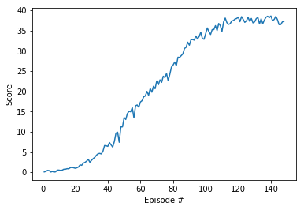

<h1>Summary</h1>
This report describes my implementation of a Deep Q-Network to trained an agent to collect yellow bananas in a large, square world.  I chose a Deep Q-Network because it is well suited for environments consisting of a discrete action space and a continous state space.

<h1>Deep Q-Networks</h1>
<h2>Abstract</h2>

Deep neural networks act as function approximators.  Specifically, Deep Q-Networks are multi-layered neural networks
that for a given state output a vector of action values with the max value indicating the action to take.  Reward changes are fed back as the reinforcement signal at each time step.  It stands to reason that, in the beginning, actions are vastly innapropriate because the neural network is initialized with random values.  Hence, it also stands to reason that, in time, actions become more appropriate as the neural network learns to associate states and state sequences with actions.

<h2>Input State Space</h2>

Even though input state spaces remain technically discrete, they can be very large and difficult to process.  To that end, in order to simplify the problem and optimize the solution, it may be necessary to scale down the input state space in order to leverage optimized neural network operations on GPUs.

<h2>Action Vector Output</h2>

Deep Q-Networks are designed to produce a Q-value for every possible action in a single forward pass.  This avoids having to run the neural network individually for every action.  This output can be used stochastically or by choosing the action corresponding to the maximum value.

<h2>Convolutional Layers</h2>

The DQN agent not only can exploit spatial relationships and spatial root space but can also extract some temporal properties.  These input and output relationships are implemented via stacked convolutional layers with RLU (regularized linear units) activation followed by a fully connected hidden layer also with RLU and a fully connected linear output layer responsible for producing the vector of output values.

<h2>Replay Buffer</h2>

As the DQN agent interacts with the environment, experience tuples are stored in a buffer.  Batches of experience tuples are then sampled in order to teach the DQN agent.  This allows the agent to learn from individual tuples multiple times particularly as it applies to rare occurrences and/or corner cases.  Most importantly, experience replay allows the agent to sample experience tuples from the replay buffer at random in order to avoid learning from highly-correlated sequence tuples.

<h2>Fixed Q-Targets</h2>

Because Q-learning is a form of temporal difference, learning can be susceptible to a detrimental moving target correlation because all of the Q-values are related according to the parameters of the approximation function.  To ascertain a stable learning environment, it is necessary to fix the function parameters that are used to generate the target (i.e., an unchanged copy of the parameters that isn't changed during the learning step or that is changed less frequently).

<h1>Implementation</h1>
<h2>model.py</h2>

<li>Responsible for building a network that maps states to action values.</li>
  
<h2>agent.py</h2>

<li>Epsilon-greedy action selection
<li>Get maximum predicted Q-values (for next states) from target model
<li>Compute Q targets for current states
<li>Get expected Q values from local model
<li>Compute loss
<li>Minimize the loss  

<h2>Hyperparameters</h2>
<li>BUFFER_SIZE = int(1e5)  # replay buffer size
<li>BATCH_SIZE = 64         # minibatch size
<li>GAMMA = 0.99            # discount factor
<li>TAU = 1e-3              # for soft update of target parameters
<li>LR = 5e-4               # learning rate 
<li>UPDATE_EVERY = 4        # how often to update the network

<h1>Results</h1>

<h1>Future Work</h1>

Improve agent performance via one of the following algorithms:

<li>Double DQN
<li>Prioritized Experience Replay
<li>Dueling DQN
