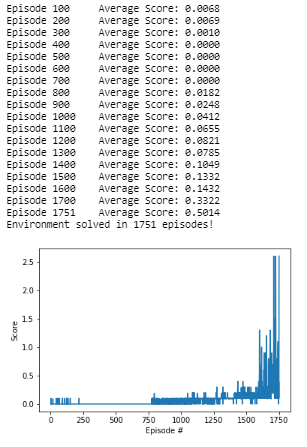

<h1>Summary</h1>
This report describes my implementation of a Deep Deterministic Policy Gradient (DDPG) Neural Network to train two agents how to play tennis with goal of keeping the ball in play.  I chose a DDPG Neural Network because, unlike a DQN, it is well suited for environments consisting of continuous action spaces.

<h1>DDPG</h1>

<b></i>After having read CONTINUOUS CONTROL WITH DEEP REINFORCEMENT LEARNING by Lillicrap, et al, I chose the DDPG algorithm because it is a model-free approach which 'can learn competitive policies for all of tasks using low-dimensional observations (e.g. cartesian coordinates or joint angles).'  More specifically, this algorithm seems well suited for this particular observation space which consists of variables corresponding to the position and velocity of the ball and rackets.</b></i>

<h2>Abstract</h2>

In DDPG, two neural networks are used.  One neural network is the actor and the other neural network is the critic.  The former is used to approximate the optimal policy deterministically - which means that we want to always output the best believed action for any given state (this is unlike stochastic policies in which we want the policy to learn the policy distribution over actions).  In other words, we want the believed best action every single time that we query the actor network.  The critic, on the other hand, learns to evaluate the optimal action value function by using the actor's best believed action.

<h2>Continuous Action Spaces</h2>

Discretizing the action space has many limitations (most notably the 'curse of dimensionality' in which the number of actions increases exponentially with the number of degrees of freedom).  In turn, finding the greedy policy in continuous action spaces requires an optimization of <i>at</t></i> at every time step - which is too slow to be practical with large, unconstrained, function approximators and non-trivial action spaces.  To overcome this problem, I implement a DDPG off-policy actor-critic algorithm using a deep function approximator that can learn policies in high-dimensional continuous action spaces.

<h2>Actor</h2>

The actor is used to approximate the optimal policy deterministically.  I.e., we want to always output the best believed action for any given state.  This is unlike a stochastic policies in which we would like the policy to learn a probability over the actions. In DDPG, we want the believed best action every single time we query the actor network (this is a deterministic policy). 

More specifically, the networks consists of 8 continuous inputs that represent the state of the environment (rectified through two fully connected Leaky ReLu layers).  Two <b>tanh</b> activated continuous output values represent the action values between -1 and 1. 

<h2>Critic</h2>

While the he actor basically learns the <i>argmax a Q(S, a)</i> which is the best action, the critic learns to evaluate the optimal action value function by using the actor's best believed action.

More specifically, like the actor network, the critic network consists of 8 continuous input representing the state of the environment (also rectified through two fully connected Leaky ReLu layers).  Unlike in the actor network, the previous' layer's output is merged with the actions and sent through another rectifying layer in order to generate a single continous output without activation.

<h2>Replay Buffer</h2>

As with a DQN agent, a DDPG agent also interacts with the environment, experience tuples are stored in a buffer.  Batches of experience tuples are then sampled in order to teach the DDPG agent.  This allows the agent to learn from individual tuples multiple times particularly as it applies to rare occurrences and/or corner cases.  Most importantly, experience replay allows the agent to sample experience tuples from the replay buffer at random in order to avoid learning from highly-correlated sequence tuples.

<h2>Target Networks Soft Updates</h2>

In DQN, you have to copies of the network weights - the regular and the target network.  In the Atari network, for example, the target network is updated every 10,000 time steps.  The weights are simply copied from the regular network into the target network.  That is, the target network is fixed for 10,000 time steps and then it gets a big update.

In DDPG, there are two copies of the network weights for each network:  a regular for the actor, an irregular for the critic, and a target for the actor, and a target for the critic.  In DDPG, the said target networks are updated using a soft update strategy which consists of slowly blending your regular network weights with your target network weights.  So, every time step, the target network will be 99.99 percent of the target network weights and only 0.01 percent of the regular network weights.  I.e., the regular network weights are slowly mixed into the target network weights.

Recall that the regular network is the most up to date network because it is the one being trained while the target network is the one used for predictions in order to stabilize strain.  Therefore, in practice, this update strategy leads to faster convergence and interoperability of network weights with other networks such as DQN. 

<h1>Implementation</h1>
<h2>model.py</h2>

<li>Responsible for building a network that maps states to action values.</li>
  
<h2>ddpg_agent.py</h2>

<li>Implement local and target copies of the actor-critic networks
<li>Initialize noise generation and replay memory
<li>Save experiences in replay memory
<li>Perform action as per current policy (noise encourages exploration)
<li>Learn by updating critic networks
<li>Soft update model parameters

<h2>Hyperparameters</h2>
<li>BUFFER_SIZE = int(1e6)    # replay buffer size
<li>BATCH_SIZE = 256          # minibatch size
<li>GAMMA = 0.999             # discount factor
<li>TAU = 1e-3                # for soft update of target parameters
<li>LR_ACTOR = 1e-4           # learning rate actor
<li>LR_CRITIC = 1e-3          # learning rate critic
<li>WEIGHT_DECAY = 1e-6       # L2 weight decay

<h1>Results</h1>

Multiple attempts were carried out by fixing the hyperparameters. The results shown below correspond to the hyperparameters shown above - which consistently solved the environment in less than 2,000 episodes.  <b><i>In this particular case, the environment was solved in 1,751 episodes!</b></i>  Details shown below:

<h1>Future Work</h1>

Implementing algorithms like PPO, A3C, and D4PG that use multiple (non-interacting, parallel) copies of the same agent to distribute the task of gathering experience.
